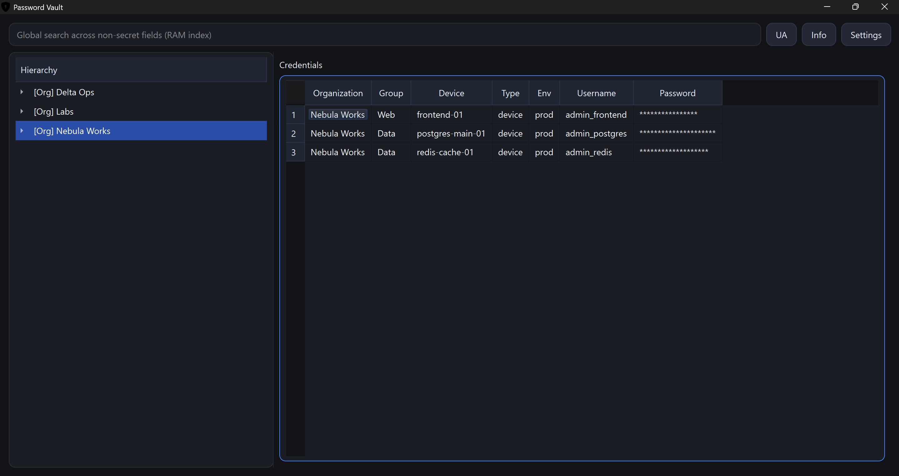
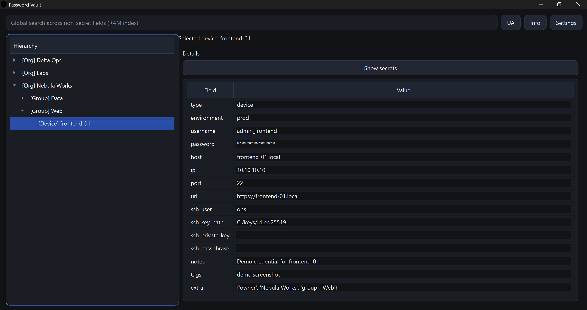
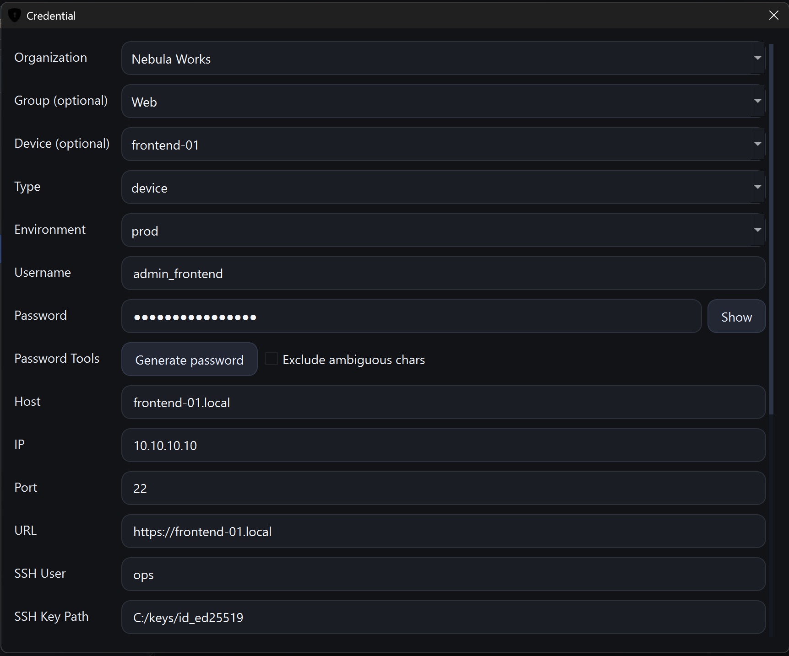

[Українська версія](README_UA.md)

# Local Infrastructure Vault

> Status: MVP / Prototype  
> Local-only encrypted infrastructure credentials vault. Not audited. Not production-ready.

Local Infrastructure Vault is a local-first encrypted desktop application for organizing technical infrastructure access: servers, cameras, edge devices, network devices, databases, APIs, SSH accounts, RTSP streams, admin panels, and internal services.

Credentials are organized through organizations, groups, devices, and related records.
The project is not cloud-based, has not undergone a professional security audit, and is not a replacement for audited enterprise password managers.

## Overview

Local Infrastructure Vault is focused on infrastructure access inventory and credentials management for technical workflows.

You can organize and store:

- organizations / clients / environments
- groups / locations / projects
- devices / servers / services
- credentials
- IP addresses
- URLs / admin panels
- SSH-related data
- RTSP / API / service endpoints
- login / password pairs
- technical notes

## What this project is for

- small technical teams
- R&D labs
- DevOps / sysadmin workflows
- infrastructure inventory with credentials
- camera / NVR / RTSP projects
- edge AI devices
- local lab environments
- offline-first internal tooling

## What this project is NOT

This project is NOT:

- a replacement for audited enterprise password managers
- a cloud password manager
- a browser autofill tool
- a mobile password manager
- a secrets manager for production CI/CD pipelines
- a zero-trust enterprise security platform

## Current Status

- MVP / prototype
- local-only
- security-focused, but not audited
- suitable for personal, lab, internal, and development infrastructure workflows
- not recommended for highly critical production secrets without independent security review

## Features

- Local encrypted infrastructure vault
- SQLite-based local storage
- Encrypted credential payloads
- Encrypted metadata
- Organization / group / device hierarchy
- Credentials linked to devices, services, and technical assets
- Support for IP, URL, login, password, SSH-related fields, and notes
- Useful for servers, cameras, routers, edge devices, lab machines, databases, APIs, and internal services
- Master password protection
- Auto-lock after inactivity
- Clipboard auto-clear for copied secrets
- Show/hide password controls
- Password generator
- Password reuse warning
- RAM-only search index
- Search over decrypted non-secret fields
- Secret-like fields excluded from search index by default
- Encrypted SQLite backup
- Local-only storage
- Security check tools
- Smoke/security test tools

## Security Model

- Data is stored locally in SQLite.
- Sensitive credential data is encrypted.
- Metadata such as organization/group/device/credential names is encrypted where possible.
- Technical IDs and relationships remain plaintext because they are required for database structure.
- Decrypted data exists in RAM only during an unlocked session.
- Search index is built in RAM after unlock.
- Search index excludes secret-like fields by default:
  - password
  - private key
  - passphrase
  - token
  - API key
  - secrets
- Clipboard cleanup is best-effort.
- SQLite secure_delete and VACUUM are used after migration where possible.
- Python cannot guarantee perfect memory wiping.

## Limitations

- No professional security audit.
- No cloud sync.
- No multi-user mode yet.
- No browser extension.
- No mobile app.
- No hardware key / 2FA yet.
- RAM cleanup is best-effort.
- Clipboard cleanup is best-effort.
- If the local machine is compromised, vault security can be compromised.
- Filesystem snapshots, backups, OS cache, antivirus quarantine, and recovery tools may retain artifacts outside application control.
- Not recommended for highly critical production secrets without independent review.

## Installation

```bash
git clone <repo-url>
cd password_vault
python -m venv .venv
```

Windows:

```powershell
.venv\Scripts\activate
pip install -r requirements.txt
python main.py
```

Linux/macOS:

```bash
source .venv/bin/activate
pip install -r requirements.txt
python main.py
```

## Usage

- Create a master password.
- Create an organization / client / environment.
- Create a group / location / project.
- Create a device / server / service.
- Add credentials and technical notes.
- Store IP / URL / SSH / RTSP / API / admin panel information.
- Search by non-secret technical fields.
- Copy secrets when needed.
- Create encrypted database backups.
- Vault auto-locks after inactivity.

Notes:

- password fields are hidden by default;
- reveal is controlled manually by user;
- copied secrets are cleared from clipboard automatically when possible.

### Usage Examples

Infrastructure credentials table with organization/group/device hierarchy:



Device or service details with quick-copy technical fields:



Credential form for server/device/service access data:



## Security Checks

```bash
python -m compileall app main.py config.py tools
python tools/smoke_security_test.py
python tools/security_check_db.py
```

- compileall checks Python syntax;
- smoke test creates a test vault;
- security check scans the SQLite database for plaintext test markers;
- these checks are useful for development;
- these checks are not a replacement for professional security audit.

## Project Structure

```text
app/
app/ui/
app/assets/
tools/
data/
main.py
config.py
```

- app/ - core application logic
- app/ui/ - PyQt UI
- app/assets/ - icons and assets
- tools/ - smoke/security helper scripts
- data/ - local runtime database directory
- main.py - application entry point
- config.py - basic configuration

## Documentation

- [docs/DEVELOPMENT.md](docs/DEVELOPMENT.md)
- [docs/SECURITY.md](docs/SECURITY.md)
- [docs/SECURITY_MODEL.md](docs/SECURITY_MODEL.md)
- [docs/THREAT_MODEL.md](docs/THREAT_MODEL.md)
- [docs/DISCLAIMER.md](docs/DISCLAIMER.md)
- [docs/CONTRIBUTING.md](docs/CONTRIBUTING.md)
- [docs/CHANGELOG.md](docs/CHANGELOG.md)
- [docs/ROADMAP.md](docs/ROADMAP.md)

## Roadmap

See [docs/ROADMAP.md](docs/ROADMAP.md).

## Contributing

Contributions are welcome.

Security-related changes should be reviewed carefully.

Please do not submit real secrets in issues, pull requests, screenshots, logs, test files, or example databases.

For security-related reports, use the contact email below.

## Contact

For questions, feedback, or security-related reports, contact:

- Developer: Anton Pobyvanets
- Email: antonpython3@gmail.com

## License

This project is released under the MIT License.
